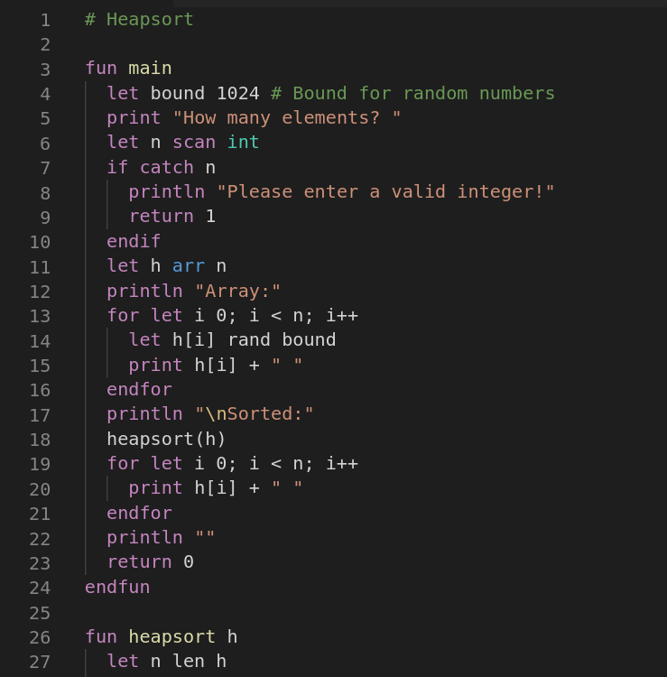

# hexiscript

## Description
hexiscript is a dynamically typed scripting language written in OCaml.

The files in the tutorials folder should give a good insight on how to use it. For some more advanced examples, check the examples folder.
## Usage
Either run `interpreter.ml`  through utop like so:

    utop interpreter.ml [filename]

or compile it with `ocamlc interpreter.ml` or `ocamlopt interpreter.ml` and then run the binary with the file you want to run. Doing the latter will actually make the language perform pretty decently. Though, of course, still significantly slower than native OCaml code (hexiscript does **not** do any optimizations).

## VSCode support
A very rough extension to provide some basic syntax highlighting for .hexi files is included in `vscode_extension`. Just copy it into `[home]/.vscode/extensions/` to install it.

## Operator precedence:
1. `function calls, [], ++ and -- (postfix)`
1. `len, rand, openin, openout, close, read, floor, ceil, sin, cos, tan, sinh, cosh, tanh, asin, acos, atan, exp, ln, log, sqrt, abs, tonum, tostr, tochar, catch, exists, keys, scan, ^^, ~, !, - (unary), ++ and -- (prefix)`
1. `*, /, %`
1. `+, -`
1. `<<, >>, >>>`
1. `<, <=, >, >=`
1. `=, !=`
1. `&`
1. `^`
1. `|`
1. `&&`
1. `||`
1. `let, print, println, return, write, throw, free, run`